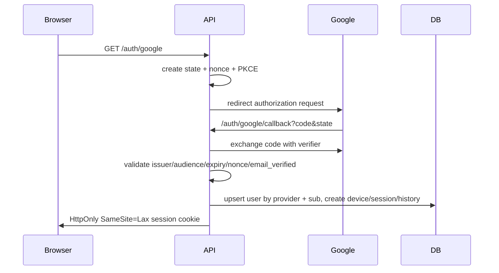

# IntelliHire Authentication and AI Architecture

## Architecture
This repository now keeps the static IntelliHire entry page and adds a reusable TypeScript server foundation under `server/`. The server owns Google OAuth/OIDC, session cookies, authorization, audit/security records, and future server-side AI calls.

## Google Cloud setup
Create an OAuth 2.0 Client ID for a web application. Configure authorized redirect URI to `GOOGLE_REDIRECT_URI`, for example `https://api.example.com/auth/google/callback`. Authorized JavaScript origins are only needed for hosted frontend origins; identity is still established by the backend callback.

## Environment variables
Copy `.env.example` to `.env` locally and set values outside git. Required production variables include `APP_URL`, `API_URL`, `DATABASE_URL`, `SESSION_SECRET`, `GOOGLE_CLIENT_ID`, `GOOGLE_CLIENT_SECRET`, and `GOOGLE_REDIRECT_URI`. NVIDIA keys are server-only and must never be exposed through `NEXT_PUBLIC_*` or frontend bundles.

## Database migration
Run `server/db/migrations/001_auth_foundation.sql` against the application database. It creates `users`, `devices`, `sessions`, `login_history`, `security_events`, and `audit_logs` with indexes and foreign keys.

## Redis
No Redis client existed in the repository. The in-process OAuth state store is isolated behind `OAuthStateStore`; it should be replaced with Redis for multi-instance production deployments using TTL keys for state, nonce, rate-limit counters, and permission cache entries.

## Session model
Sessions are server-managed. The browser receives only an opaque high-entropy `ih_session` cookie. The database stores a SHA-256 hash of the token, supports multi-device sessions, revocation, expiration, logout current session, and logout all devices.

## Authorization model
`requireAuth`, `requireRole(...)`, and `requirePermission(...)` centralize backend authorization. Roles are `USER` and `ADMIN`; users also have a JSON permission list for granular future modules.

## NVIDIA AI provider
`AIProvider` defines `generate`, `analyzeText`, `analyzeVision`, and `healthCheck`. `NvidiaAIProvider` selects centrally registered models by capability, applies timeouts, retries, rate-limit/budget controls, structured error mapping, response validation, and secret redaction. Frontend code must never call NVIDIA directly.

## Testing
Run `npm test`. Tests mock Google claims and NVIDIA HTTP responses; they do not require real credentials.

## Production deployment and security
Use HTTPS, secure cookies, a long random `SESSION_SECRET`, a persistent database, Redis for ephemeral state in multi-instance environments, strict CORS allowlists, and centralized security logging. Never log authorization codes, tokens, cookies, client secrets, NVIDIA keys, or raw credential material.
